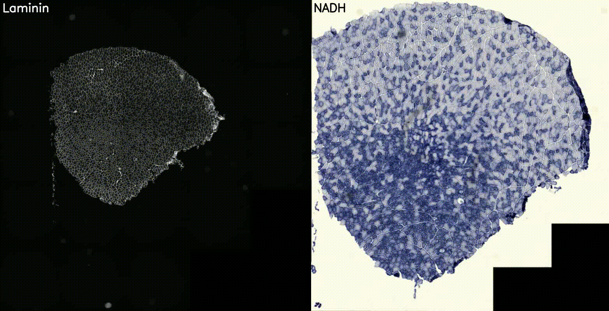

# F2FMatcher — Fiber-to-Fiber Matching Across Histological Stains

F2FMatcher identifies corresponding muscle fibers across pairs of histological images taken from serial sections of the same tissue sample, even when the sections are stained with different markers (e.g., immunofluorescence vs histochemistry, or different IHC panels). It combines a **VAE** that encodes Cellpose flow fields into a compact latent space, a **pairwise classifier** that scores fiber similarity across stains, and a **geometry-aware matching algorithm** that iteratively propagates matches under spatial consistency constraints.



*Two serial muscle sections stained with different markers. Cellpose segments individual fibers; F2FMatcher links corresponding fibers across the two stains using VAE embeddings, pairwise classification, and iterative geometry-constrained label propagation.*

## Pipeline Overview

```
CZI/PNG input
    │
    ▼
1. Image I/O — Export CZI to PNG, resize to reference pixel resolution
    │
    ▼
2. Cellpose Segmentation — Finetuned Cellpose models → masks + flow fields (x, y, cell probability)
    │
    ▼
3. ROI Cropping — 256×256 crops around each fiber centroid → .npz (flow_x, flow_y, roi_mask)
    │
    ▼
4. VAE Embedding — Convert flow fields to mag/angle, resize 128×128, encode → 256-dim latent vector
    │
    ▼
5. Pairwise Classifier — Score all cross-image ROI pairs → N₁ × N₂ logit matrix
    │
    ▼
6. Matching Algorithm — Cost = classifier × spatial signature → initial guess (triangle geo. filter) → iterative local propagation → Hungarian fill
    │
    ▼
7. Output — paired_labels.pkl + visualization PNGs (matched contours with pair IDs)
    │
    ▼
8. Quantification — Per-channel staining intensity in matched ROIs (membrane, cytoplasm, whole)
```

---

## Model Architecture

### VAE: SharedMultiHeadVAE

The VAE compresses Cellpose flow fields (256×256 ROI crops resized to 128×128) into 256-dimensional latent vectors.

**Encoder (VAEEncoder):**
```
Input: 3 × 128 × 128 (mag, angle, roi_mask)
    │
    ├─ Conv2d(3→64) → ReLU
    ├─ Conv2d(64→64) → ReLU → MaxPool(2×2)
    ├─ Conv2d(64→128) → ReLU
    ├─ Conv2d(128→128) → ReLU → MaxPool(2×2)
    ├─ Conv2d(128→256) → ReLU
    ├─ Conv2d(256→256) → ReLU → AdaptiveAvgPool(4×4)
    │
    ├─ fc_mu: Linear(4096 → 256)
    └─ fc_logvar: Linear(4096 → 256)
```

**Latent space:** 256-dim, trained with reparameterization trick.

**Decoder (Shared + multi-head):**
```
Latent z (256-dim)
    │
 Linear(256 → 512×8×8) → reshape (512, 8, 8)
    │
 Shared decoder (transposed conv):
    ConvTranspose2d(512→256, 4, stride=2) → ReLU  # 16×16
    Conv2d(256→256, 3) → ReLU
    ConvTranspose2d(256→128, 4, stride=2) → ReLU  # 32×32
    Conv2d(128→128, 3) → ReLU
    ConvTranspose2d(128→64, 4, stride=2) → ReLU   # 64×64
    Conv2d(64→64, 3) → ReLU
    ConvTranspose2d(64→32, 4, stride=2) → ReLU    # 128×128
    │
 Three output heads (each: Conv2d(32→16) → ReLU → Conv2d(16→1)):
    ├── head_fx:   reconstructs flow_x
    ├── head_fy:   reconstructs flow_y
    └── head_mask: reconstructs roi_mask
```

**Training losses:**
- **Reconstruction loss:** MSE on flow_x, flow_y, roi_mask (sum)
- **KL divergence:** weighted by β_KL (default 0.001)
- **Latent consistency:** MSE between paired augmented views (β_consistency = 1.0)

### Pairwise Classifier (PairClassifier)

A binary classifier that determines whether two ROI embeddings originate from the same fiber.

```
Embedding₁ (256-dim) ─┐
                       ├─ concat → Linear(512→128) → ReLU → Dropout(0.5)
Embedding₂ (256-dim) ─┘           → Linear(128→64) → ReLU → Dropout(0.5)
                                  → Linear(64→1) → Sigmoid → score [0, 1]
```

**Training:** BCELoss, Adam (lr=1e-4), early stopping on validation F1 (patience=10). Negative pairs are sampled at 4× the rate of positive pairs (`negative_fold=4`). Best checkpoint achieves val F1 ≈ 0.944.

---

## Matching Strategy

The matching algorithm (`match_fibers` in `src/f2fmatcher/matching/matcher.py`) proceeds in four stages:

### Stage 1: Cost Matrix Computation

Two complementary costs are computed for every cross-image pair of ROIs:

| Cost component | Description |
|---|---|
| **Classifier logits** `S[i,j]` | PairClassifier score: how likely ROI i (img1) and ROI j (img2) are the same fiber |
| **Spatial signature similarity** `W[i,j]` | Geometric niche: k-nearest-neighbor distance vectors (k=3,5,7) are compared via Wasserstein distance across scales, then geometrically averaged |

**Combined cost:** `cost[i,j] = S[i,j] × W[i,j]`

### Stage 2: Initial Guess with Geometric Filtering

1. Select the top N (default N=80) highest-scoring pairs from the cost matrix (greedy, no duplicates)
2. For every combination of `n_pair_selected` (default 4) among those N:
   - Check **triangle geometry**: for all triplets within the combination, compare side lengths and angles of the triangles formed by the centroids of images 1 and 2
   - Require `cost_sides < 30` AND `cost_angles < 0.15` for every triplet
3. Only pairs appearing in at least one valid combination are kept as seeds

This ensures the initial set is geometrically consistent under local affine transformations between the two serial sections.

### Stage 3: Iterative Local Propagation

Starting from the validated seed pairs, the algorithm iteratively expands:

```
For each matched pair (A₁, A₂):
    1. Find all ROIs within distance_neighbors_ref (200 px) of A₁ in image 1
       and of A₂ in image 2
    2. Among those neighbors, consider unannotated cross-image pairs
    3. For the highest-scoring candidate pair (B₁, B₂):
        a. Find the 3 nearest already-matched ROIs to B₁ in image 1
        b. Match them to their paired ROIs in image 2
        c. Check triangle geometry: (B₁, neighbor_i, neighbor_j) vs (B₂, matched_i, matched_j)
        d. Accept if geometric distortion is below thresholds
    4. Update the prediction matrix and repeat until <0.25% new pairs per step
```

**Convergence** is reached when fewer than 0.25% of total ROIs are added in one step.
Intermediate results (`paired_labels.pkl`) are saved after each propagation step to prevent data loss if the pipeline is interrupted.

### Stage 3b: Pre-caching for Faster Re-runs

To skip Cellpose segmentation and VAE embedding on subsequent runs:

```bash
# Copy pre-computed masks, flows, and images
cp $SRC/out_CP_masks/*_{CP_masks,CP_flows}.pkl $OUT/out_CP_masks/
cp $SRC/images_segmentation/*.png $OUT/images_segmentation/

# Run only the matching stage
f2fmatcher run-pipeline ... --skip-vae-inputs --skip-embeddings
```

Classifier scores are also cached to disk (`{dir_embedding}/{img1}_vs_{img2}_scores.npy`) so the 30-40s cost-matrix computation is skipped on re-runs.

### Stage 4: Fill Unannotated ROIs

For remaining unmatched ROIs:
1. Estimate an **affine transform** from all matched centroids (img₁ → img₂)
2. Transform each unmatched ROI centroid from image 1 into image 2 coordinates
3. For each, find candidate ROIs in image 2 within `max_distance_affine` (150 px) with classifier score > `min_cls_logit`
4. Filter candidates by triangle geometry against nearest matched neighbors
5. Add the best valid match

### Post-processing

- **Deduplication:** Remove any ROI matched to multiple partners
- **Validation filtering:** Re-check every match against its 3 nearest matched neighbors using triangle geometry

---

## Installation

```bash
# 1. Create conda environment
conda env create -f environment.yml
conda activate fibermatcher

# 2. Install the package
pip install -e .

# 3. Verify model checkpoints are present (included in repo):
ls models/
#    Expected: LatentVAE2_256_128.pth, fibermatcher_cls_2.pth, models/CellPose2_finetuned/
```

## Usage

### Single image pair

```bash
f2fmatcher run-pipeline \
    --img1 TAG01 --img2 TAG01 \
    --source1 /path/to/imgs1 --source2 /path/to/imgs2 \
    --cp-model-1 "CP_AV_Laminin_Dia_Qua_TA_AxioScan10X" \
    --cp-model-2 "CP_AV_TA_COX-SDH-NADH_AxioScan10X" \
    --param-img1 fluorescence --param-img2 brightfield \
    --obj1 40X --obj2 10X --channel1 0 --channel2 0 \
    --czi1 --czi2 \
    --output /path/to/output \
    --export-images
```

### Batch processing

```bash
f2fmatcher run-pipeline --param-file /path/to/param_file.py
```

The param file defines: `source_1`, `source_2`, `czi_img1`, `channel_index_img1`, `CP_model_name_1`, `list_pair_images`, etc.

### Training

```bash
# Train VAE
f2fmatcher train-vae --config configs/default.yaml --checkpoint-dir ./checkpoints

# Train classifier
f2fmatcher train-classifier --config configs/default.yaml --checkpoint-path ./classifier.pth
```

## Configuration

All pipeline parameters are in `configs/default.yaml`. Key sections:

| Section | Key parameters |
|---|---|
| `dataset` | `crop_size: 256`, `resize: 128`, `n_augmentation: 50` |
| `vae` | `latent_dim: 256`, `checkpoint: models/LatentVAE2_256_128.pth` |
| `classifier` | `checkpoint: models/fibermatcher_cls_2.pth`, `batch_size: 256`, `lr: 0.0001` |
| `cellpose` | `model_path: models/CellPose2_finetuned`, `flow_threshold: 0.4` |
| `matching` | `use_multiprocessing: true` (uses `joblib.Parallel` with `n_jobs=n_processes`) |
| `matching` | `n_initial_guess: 80`, `distance_neighbors_ref: 200`, `min_cls_logit: 0.5` |

## Project Structure

```
├── src/f2fmatcher/
│   ├── config.py              # YAML config loader
│   ├── cli.py                 # CLI entry point
│   ├── scripts/               # Runnable CLIs (pipeline, training)
│   ├── io/                    # CZI reader, pixel sizes
│   ├── segmentation/          # Cellpose wrapper, augmentation
│   ├── vae/                   # VAE model, dataset, training, embedding
│   ├── classifier/            # PairClassifier, dataset, training
│   ├── matching/              # Spatial signatures, cost matrix, propagation, intermediate saves
│   ├── analysis/              # Staining quantification
│   ├── visualization/         # Prediction plots
│   └── utils/                 # Seed, IO helpers
├── configs/                   # YAML config files
├── tests/                     # Unit tests
├── notebooks/                 # Annotation QA notebooks
└── pyproject.toml             # Package definition
```

### Overriding cellpose.model_path

The default Cellpose model path in `configs/default.yaml` resolves to the bundled `models/CellPose2_finetuned/` directory. If your system has a separate model zoo, you can override it by creating a minimal YAML and passing it via `--param-file`:

```yaml
# config_override.yaml
cellpose:
  model_path: /media/DATABRUT/DB_DDC/serverGPU/CellPose_DDC/CP_model_zoo/models
```

Then run with:
```bash
f2fmatcher run-pipeline --param-file config_override.yaml ...other args...
```

The `cellpose.model_path` is a *directory* containing model files; the individual model is selected by `--cp-model-1` / `--cp-model-2`.

---

## Data Format

| Stage | Format | Content |
|---|---|---|
| Raw input | `.czi` or `.png` | Full histological slide (Zeiss AxioScan) |
| Cellpose masks | `.pkl` | Tuple: (masks, flows, styles) |
| ROI crops | `.npz` | `flow_x`, `flow_y`, `cell_prob`, `roi_mask` (256×256) |
| VAE embeddings | `.npy` | 256-dim float32 vector per ROI |
| Matching output | `.pkl` | List of `(label_img1, label_img2)` matched pairs |

## Matching Performance (typical)

| Metric | Value |
|---|---|
| ROIs per image | 2,000 – 3,500 |
| Matched pairs per pair | 1,900 – 3,100 |
| Coverage | 50 – 95% |
| Propagation steps | 6 – 12 |
| Initial seeds | 12 – 80 selected from 80 guesses |
| Classifier val F1 | ≈ 0.944 |
| Propagation convergence | <0.25% new pairs per step |

### Real-world example: TAG04 (DYS_COL4 vs IgG_CD11B, 3318×3363 ROIs)

| Metric | Value |
|---|---|
| Reference pairs (production pipeline) | 3,172 |
| Pairs matched (this pipeline) | 3,168 (99.8% overlap) |
| Steps to converge | 9 |
| Wasserstein computation | ~36 s (3 k-values × 12 s, 60 processes) |
| Local prediction per step | 20–80 s (longer in early steps with ≥1000 seeds) |
| Total runtime (fresh) | ~12 min |
| Total runtime (cached scores + pre-cached masks) | ~10 min |
| GPU memory | negligible (classifier inference only) |
| CPU peak | ~10 GB for 3318×3363 cost matrix (float32) |

### Propagation step breakdown (TAG04)

| Step | Seeds | New pairs | Total | Time (s) |
|------|-------|-----------|-------|----------|
| 1 | 80 | +864 | 944 | ~1 |
| 2 | 806 | +829 | 1,773 | 67 |
| 3 | 968 | +630 | 2,403 | 79 |
| 4 | 1,070 | +452 | 2,855 | 87 |
| 5 | 1,150 | +218 | 3,073 | 95 |
| 6 | 1,014 | +54 | 3,127 | 80 |
| 7 | 970 | +21 | 3,148 | 78 |
| 8 | 937 | +13 | 3,161 | 75 |
| 9 | 755 | +5 | 3,166 + 2 fill | 59 |

### Time & hardware estimates

Timing depends primarily on ROI count and available CPU cores for parallel computation (Wasserstein and local propagation both scale with `n_processes`).

#### ~3,000 ROIs per image (e.g., mouse TA)

| Hardware | Runtime per pair |
|---|---|
| 60 CPU cores | ~12 min |
| 32 CPU cores | ~18 min |
| 16 CPU cores | ~30 min |
| 8 CPU cores | ~55 min |
| 4 CPU cores | ~100 min |

| Resource | Usage |
|---|---|
| RAM | ~10 GB |
| VRAM | ~2 GB (GPU only for classifier inference) |
| Storage | ~2 GB per pair (embeddings, npz, outputs) |
| GPU | Any CUDA-capable GPU with ≥4 GB VRAM |

#### ~6,000 ROIs per image (e.g., mouse Quadriceps)

| Hardware | Runtime per pair |
|---|---|
| 60 CPU cores | ~35 min |
| 32 CPU cores | ~55 min |
| 16 CPU cores | ~100 min |
| 8 CPU cores | ~3 h |
| 4 CPU cores | ~6 h |

| Resource | Usage |
|---|---|
| RAM | ~20 GB |
| VRAM | ~6 GB |
| Storage | ~6 GB per pair |
| GPU | CUDA GPU with ≥8 GB VRAM recommended |

**Scaling notes:**
- Wasserstein similarity and classifier inference scale **O(N₁ × N₂)** in the number of ROIs
- Local propagation scales with the number of matched seeds × average neighbor count within `distance_neighbors_ref` (200 px) — roughly **O(N¹·²)** due to spatial clustering
- Cost matrix size: ~11 M entries at 3k ROIs (44 MB float32), ~36 M at 6k ROIs (144 MB float32)
- Disk cache for scores (`*_vs_*_scores.npy`) is 44–144 MB per pair

### Speed-up tips

- **Cache scores**: run once, then `{dir_embedding}/*_vs_*_scores.npy` loads automatically (~36 s saved)
- **Pre-cache CP masks**: copy masks/flow pkl files to output dir (~2 min saved)
- **Reduce `distance_neighbors_ref`** (default 200): lowering to 150 shrinks submatrices in dense clusters, cutting ~15% per step at the cost of slightly fewer matches in sparse regions
- **Intermediate saves**: added after each propagation step — partial results survive if the pipeline is interrupted

## License

MIT License (see `LICENSE`).

## Acknowledgments

This software uses **[Cellpose 2.0](https://www.cellpose.org/)** (Stringer et al., 2021; Pachitariu et al., 2022) for cell/fiber segmentation. The finetuned Cellpose models were trained by the DDC team (Genethon).

- Stringer, C., Wang, T., Michaelos, M., & Pachitariu, M. (2021). Cellpose: a generalist algorithm for cellular segmentation. *Nature Methods*, 18, 100–106.
- Pachitariu, M. & Stringer, C. (2022). Cellpose 2.0: how to train your own model. *Nature Methods*, 19, 1634–1641.
